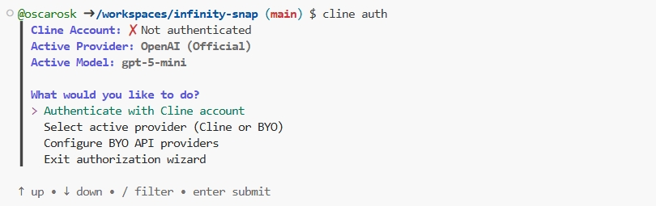
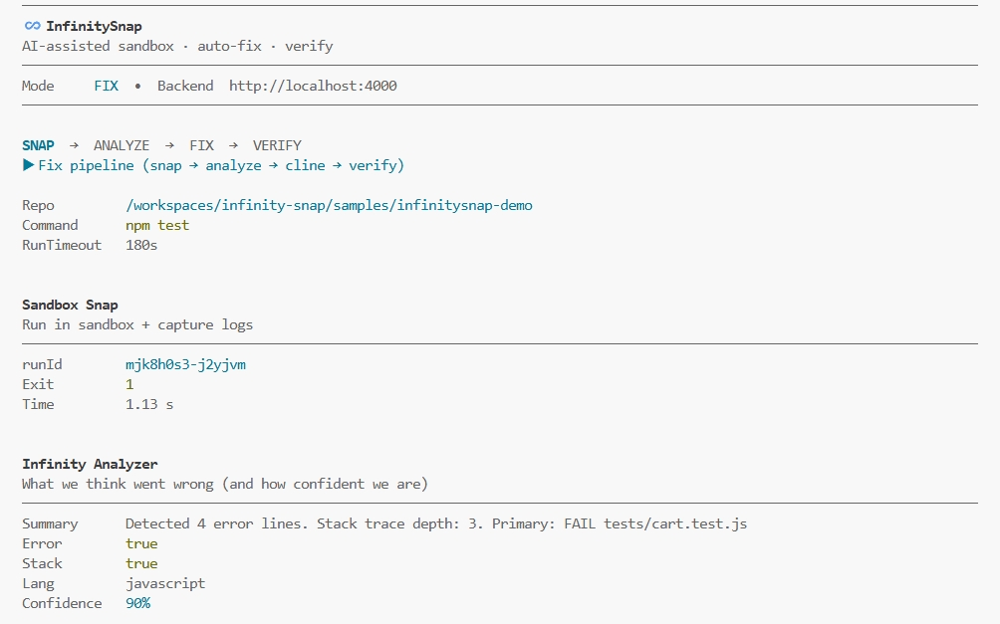
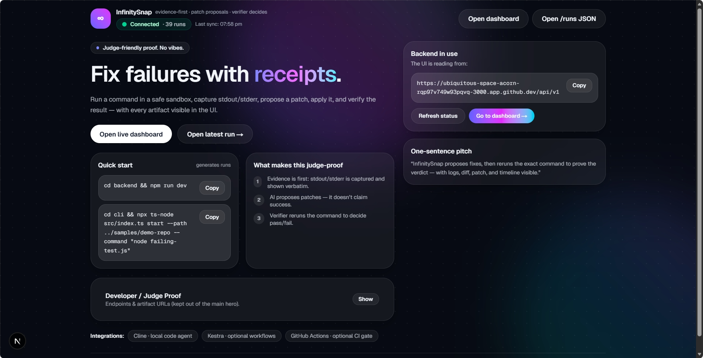
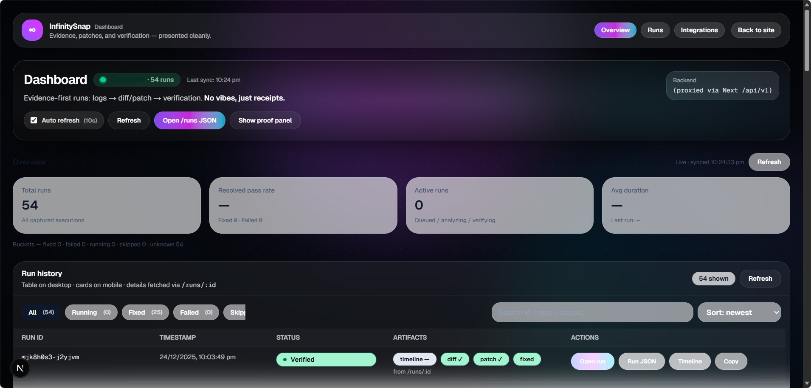
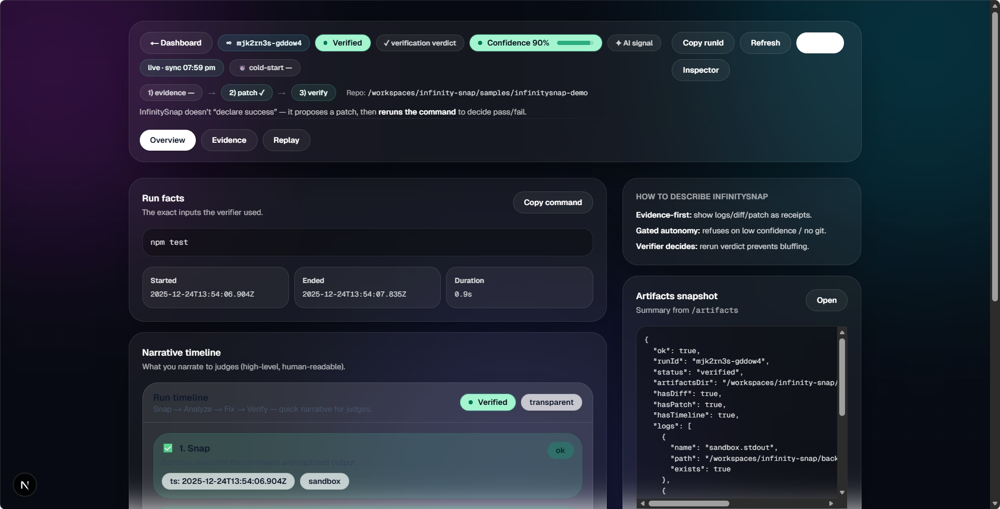

# ♾️ InfinitySnap

**InfinitySnap is a supervised autonomous code-fixing system with explicit policy enforcement, verification, rollback, and full replayability.**

InfinitySnap wraps the Cline CLI inside a **strict, auditable control loop** designed for **correctness, transparency, and restraint** — not blind automation.

> **Correctness > speed**  
> **Transparency > magic**

---

## 🔍 What Problem InfinitySnap Solves

Most autonomous “auto-fix” tools:
- silently modify code
- apply unverified changes
- fail without explanation
- cannot be audited after execution

**InfinitySnap is intentionally different.**

It treats autonomy as a **controlled capability**, not a default behavior.

Every fix is:
- confidence-gated  
- policy-constrained  
- verified deterministically  
- recorded step-by-step  

Nothing is hidden.

---

## 🧠 Core Philosophy

InfinitySnap is **not a coding assistant**.  
It is a **supervised autonomous system**.

The agent:
- cannot act freely
- cannot bypass policy
- cannot apply unverified changes
- cannot hide failures or reasoning

Judges and reviewers can inspect **every artifact**.

---

## 🧬 End-to-End Lifecycle

A single InfinitySnap run follows this lifecycle:

1. **Sandbox Execution**  
   Run the command (direct or isolated).

2. **Failure Analysis**  
   Parse stdout/stderr, stack traces, error signals.

3. **Confidence Gate**  
   If confidence < threshold → **refuse** (no edits).

4. **Supervised Fix (Cline)**  
   Generate a patch under strict policy constraints.

5. **Verification**  
   Re-run the original command.

6. **Rollback (if needed)**  
   Failed verification or policy violation → revert.

7. **Replay & Artifacts**  
   Persist logs, diffs, metrics, and a full timeline.

---

## 🏗️ System Architecture

```
Developer / CI / Judge
        |
        v
InfinitySnap CLI (optional)
        |
        v
Backend API (Express)
        |
        +-- Sandbox Runner
        |   - direct mode
        |   - sandbox copy mode
        |
        +-- Analyzer
        |   - error extraction
        |   - confidence scoring
        |
        +-- Policy Engine
        |   - command restrictions
        |   - patch constraints
        |
        +-- Cline Executor (supervised)
        |   - constrained autonomy
        |
        +-- Verifier
        |   - deterministic re-run
        |
        +-- Artifact Store
            - logs
            - patch / diff
            - timeline (txt + json)
```

Artifacts are stored **on disk** and served via **explicit HTTP endpoints**.  
There is no hidden state.

---

## 🧪 Execution Modes

InfinitySnap supports two execution modes:

### Direct Mode (Fast)
- Runs commands directly in the repository
- Used for demos and trusted code
- No repository copy (`copyMs = 0`)

### Sandbox Mode (Safe)
- Copies repository (with excludes)
- Executes in a temporary directory
- Cleanup is timed and logged

The execution mode is **always recorded in the timeline**.

---

## 🚦 Confidence-Gated Autonomy

Before any fix is attempted:

- failure signals are analyzed
- a confidence score is computed
- a threshold is enforced

If confidence is below threshold:

```
status: refused_low_confidence
```

- No patch is generated  
- No files are touched  

This restraint is intentional.

---

## 🔐 Policy & Safety Guarantees

InfinitySnap enforces safety through **explicit gates**:

### Command Policy
- Blocks destructive or unsafe commands
- Optional allowlist enforcement

### Patch Policy
- Blocks sensitive paths (`.env`, `.ssh`, credentials)
- Limits scope of modifications

### Verification Requirement
- Changes persist only if verification passes
- Failure triggers automatic rollback

Every decision is:
- logged
- timestamped
- replayable

---

## 🤖 AI Model & Provider

InfinitySnap does **not directly call OpenAI APIs** in its backend logic.  
Instead, it delegates reasoning to **Cline**, operating in **ACT mode**.

Typical demo configuration (via Cline):

- **Provider:** OpenAI (native)
- **Model:** `gpt-5-mini`
- **Mode:** ACT (execution-focused)
- **Reasoning Effort:** medium
- **Planning:** bounded
- **Thinking Budget:** capped



Model configuration is explicit and inspectable:

```bash
cline config list --output-format json
```

InfinitySnap treats the model as a **tool**, not a decision-maker.

---

## 🧾 Artifacts & Replay

Each run produces complete, inspectable artifacts:

- sandbox stdout / stderr
- analyzer output
- generated patch
- git diff
- verification logs
- execution timeline

### Timeline (Human-readable)

```bash
GET /api/v1/runs/:id/timeline
```

Example:
```
[0.00s] fix.start → start
[0.01s] fix.cline → start
[163.35s] fix.cline → ok
[163.51s] fix.verify → start
[164.52s] fix.verify → ok
[164.52s] fix.complete → verified
```

### Timeline (Machine-readable)

```bash
GET /api/v1/runs/:id/timeline.json
```

---

## 📸 Screenshots

Place real screenshots under `docs/screenshots/` and reference them here:

```md



```

---

## 📂 Repository Structure

```
infinity-snap/
├── backend/
│   ├── src/
│   │   ├── analyzer.ts
│   │   ├── sandboxRunner.ts
│   │   ├── policy.ts
│   │   ├── routes.ts
│   │   ├── timeline.ts
│   │   ├── runStore.ts
│   │   ├── verifier.ts
│   │   └── start.ts
│   ├── .data/
│   │   ├── runs/
│   │   ├── logs/
│   │   ├── diffs/
│   │   └── artifacts/
│   └── package.json
│
├── infinitysnap-dashboard/    # Next.js dashboard UI
│   ├── src/
│   │   ├── app/
│   │   ├── components/
│   │   └── lib/
│   └── package.json
|
├── cli/
│   ├── src/
│   │   ├── apiClient.ts
│   │   ├── commands/
│   │   ├── config.ts
│   │   └── ui/
│   └── package.json
│
├── samples/
│   └── infinitysnap-demo/
│       ├── src/
│       ├── tests/
│       └── package.json
│
├── scripts/
│   └── cline.sh
│
└── README.md
```

---

## 🚀 Quickstart

### Start Backend
```bash
cd backend
npm install
npm run dev
```

Health checks:
```bash
curl http://localhost:4000/health
curl http://localhost:4000/api/v1/health
```

### Run Demo
```bash
cd samples/infinitysnap-demo
npm test
infinitysnap fix . --command "npm test"
```

---

## 🔌 API Reference

Base URL:
```
http://localhost:4000/api/v1
```

### List runs
```bash
GET /runs
```

### Run artifacts
```bash
GET /runs/:id/artifacts
```

### Logs
```bash
GET /runs/:id/logs
GET /runs/:id/logs?view=combined
GET /runs/:id/logs/:name
```

### Fix pipeline
```bash
POST /runs/:id/fix
```

Possible outcomes:
- `verified`
- `rolled_back`
- `refused_low_confidence`
- `refused_not_git`

Refusals are intentional and recorded.

---

## ⏱️ Performance Notes

- Snap and Verify are usually fast (command execution time).
- Fix duration depends on model reasoning and repository scope.
- Timeline explicitly shows where time is spent (`fix.cline`).
- InfinitySnap prioritizes **correctness and auditability over raw speed**.

---
## ⏱️ Timeout Diagnostics & Fix

InfinitySnap is designed to never hang silently.
If a backend fix takes too long, the CLI intentionally falls back to a local, supervised Cline execution.

This section documents how to diagnose timeout issues and how they were fixed.

## 🔍 Problem Observed
During early runs, the CLI showed:

- ✖ Calling /runs/:id/fix …
- ⚠ Backend /runs/:id/fix threw — falling back to local Cline.

Even though the backend fix eventually succeeded when triggered manually.

## 🧪 Diagnostic Step — Prove Where the Timeout Occurs

Run the fix with all FIX-related timeouts disabled:
```
export INFINITYSNAP_FIX_HTTP_TIMEOUT_MS=0
export INFINITYSNAP_FIX_TIMEOUT_MS=0
infinitysnap fix . --command "npm test"
```
---

## 🎥 Demo Video

▶️ **InfinitySnap — End-to-End Demo (2 minutes)**

[](https://youtu.be/MHUh92WWApg)

---

### Dashboard


